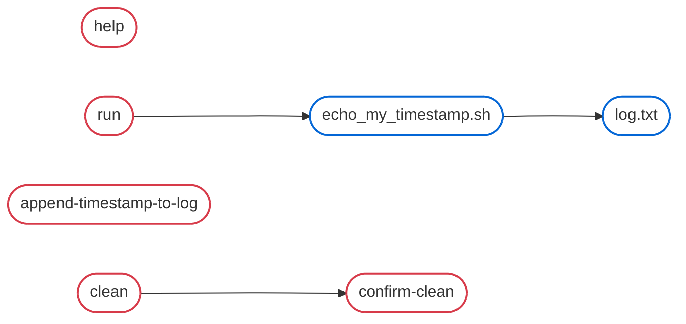

# Makefile Sandbox

A simple demonstration of GNU Make dependencies, incremental builds (based on timestamps), inclusion of external Makefiles, macros, and self-documentating Makefiles etc.

## Quick start
```bash
make help
```

## Graph of dependencies


## Demo
```bash
# First run generates log.txt, echo_my_timestamp.sh
~/make-sandbox/basics [main]% make run
Invoking log.txt at TIMESTAMP=08-07-2026_14-51-44
Invoking echo_my_timestamp.sh at TIMESTAMP=08-07-2026_14-51-44
Invoking run at TIMESTAMP=08-07-2026_14-51-44
My timestamp is TIMESTAMP=08-07-2026_14-51-44

# Subsequent runs do not regenerate log.txt and echo_my_timestamp.sh
~/make-sandbox/basics [main]% make run
Invoking run at TIMESTAMP=08-07-2026_14-51-53
My timestamp is TIMESTAMP=08-07-2026_14-51-44

# Append timestamp to log.txt to make echo_my_timestamp.sh out-of-date
~/make-sandbox/basics [main]% make append-timestamp-to-log
Invoking append-timestamp-to-log at TIMESTAMP=08-07-2026_14-52-10

# echo_my_timestamp.sh is out-of-date and is re-generated
~/make-sandbox/basics [main]% make run
Invoking echo_my_timestamp.sh at TIMESTAMP=08-07-2026_14-52-14
Invoking run at TIMESTAMP=08-07-2026_14-52-14
My timestamp is TIMESTAMP=08-07-2026_14-52-14

# Clean the artifacts upon confirmation
~/make-sandbox/basics [main]% make clean
Are you sure you want to proceed with clean? [y/N]: y
Invoking clean at TIMESTAMP=08-07-2026_14-52-30
```
